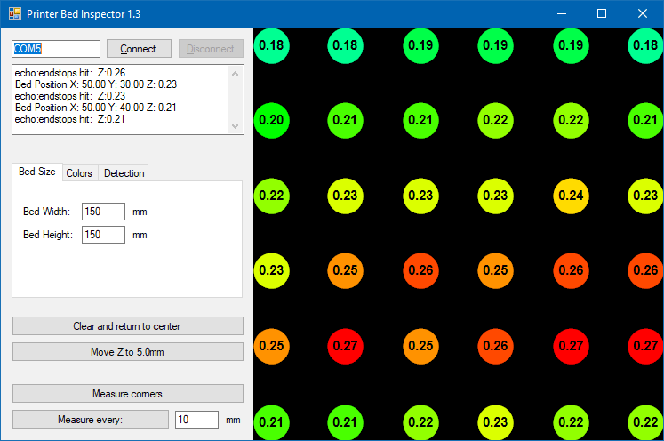

Printer Bed Inspector
===

A Windows utility for 3D printers equipped with automatic levelers.  It tests multiple points to evaluate bed flatness.

While troubleshooting prints that always peeled up in a particular spot, I spot-checked a few positions (with the "G30" g-code) and discovered the surface of the bed was a good deal less linear than I'd expected.  I wanted a clearer picture, so I created this utility.  The variation between the highest peak and lowest valley was 0.25mm.  That doesn't sound like much, but it's more than two print layers if you're printing at 0.1mm!

**Compatibility**: PrintrBot Simple Metal (**assumes a 150mm x 150mm bed**!)

**Instructions**

1. Type in your printer's serial port address at the top left and click Connect.
2. (Your printer should automatically home, center, and measure the height: G28 & G30)
3. Click around in the field to measure that location. (G1 followed by G30)
4. To measure many points automatically, click the little drop-down arrow at the lower-left corner and choose one of the patterns.  The screenshot shows the "19x19 pattern".
